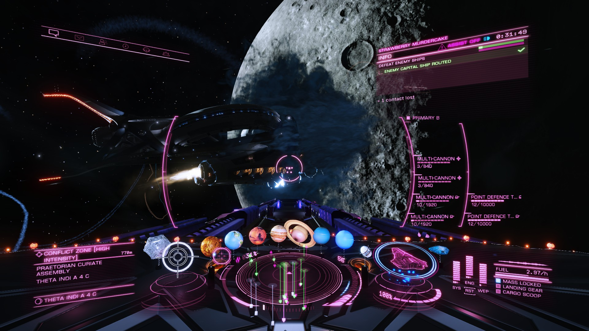

If you want your HUD in Elite Dangerous a spicy pink, here ya go. Installation instructions after the screenshot.



I use [EDFX](http://edcodex.info/?m=tools&entry=58) to set my HUD colours, and if you're using it, you can place the ```Ambient.Impact.Pink``` folder in:

```<EDFX install folder>\gamefiles\Elite Dangerous\cockpit\hudcolorprofiles```

If you prefer to manually install the colours, [this HUD editor](https://arkku.com/elite/hud_editor/) has instructions at the bottom for how to do so.

o7